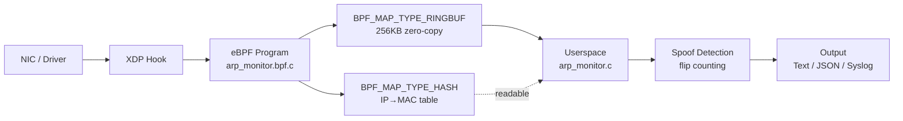

# ARP Monitor — eBPF/XDP

[](https://github.com/saultab/arp-monitor-ebpf-xdp/actions)
[](LICENSE)
[-orange.svg)](#system-requirements)
[](#tech-stack)

## What is this?

A **pure C implementation** of a real-time ARP traffic monitor with **ARP spoofing detection**, powered by **eBPF/XDP** for kernel-level packet inspection at wire speed. Uses a **zero-copy ring buffer** (`BPF_MAP_TYPE_RINGBUF`) to stream ARP events from kernel to userspace with no runtime overhead — packets are inspected and classified before they even reach the network stack.

## Why this project matters

This project demonstrates proficiency in:

| Skill Area | How it's demonstrated |
|------------|----------------------|
| **C systems programming** | Manual memory management, signal handling, graceful shutdown, POSIX APIs, strict `-Wall -Wextra -Werror -pedantic` compilation |
| **Network security** | ARP spoofing detection via IP→MAC tracking with flip-count thresholds, whitelist support, real-time alerting |
| **eBPF/kernel programming** | XDP hook at the lowest network layer, BPF verifier compliance, bounded packet access patterns, CO-RE/BTF for cross-kernel portability |
| **Performance engineering** | Zero-copy ring buffer, no heap allocation in hot path, kernel-bypass packet inspection, O(1) hash lookups |
| **Memory safety in C** | AddressSanitizer/UBSan clean, Valgrind clean, explicit bounds checking on every packet access, no buffer overflows |

## Tech Stack

| Component | Version / Detail |
|-----------|-----------------|
| Language | C11 (GNU extensions) |
| BPF library | libbpf 1.x (system or vendored) |
| Skeleton gen | bpftool (`bpftool gen skeleton`) |
| BPF compiler | Clang/LLVM (BPF target) |
| BTF support | vmlinux.h (auto-generated from running kernel) |
| Build system | GNU Make |
| Testing | Custom minimal framework + bash integration tests |
| CI | GitHub Actions (multi-kernel, ASan, cppcheck) |

## System Requirements

### Kernel
- Linux **5.15+** with BTF support
- Required kernel configs:
  ```
  CONFIG_DEBUG_INFO_BTF=y
  CONFIG_BPF=y
  CONFIG_BPF_SYSCALL=y
  CONFIG_XDP_SOCKETS=y
  CONFIG_NET_CLS_BPF=y
  ```
- Verify BTF: `ls /sys/kernel/btf/vmlinux`

### Permissions
The binary requires elevated privileges:
- **Root**, or
- Capabilities: `CAP_BPF` + `CAP_NET_ADMIN` + `CAP_PERFMON`
  ```bash
  sudo setcap cap_bpf,cap_net_admin,cap_perfmon=eip ./arp-monitor
  ```

### Tested distributions
- Ubuntu 22.04 / 24.04
- Fedora 38+
- Debian 12+
- Arch Linux (rolling)

## Installation

### Dependencies

**Ubuntu / Debian:**
```bash
sudo apt-get install -y \
    clang llvm llvm-dev \
    libelf-dev zlib1g-dev \
    libbpf-dev bpftool \
    linux-tools-common linux-tools-$(uname -r) \
    make gcc pkg-config
```

**Fedora:**
```bash
sudo dnf install -y \
    clang llvm llvm-devel \
    elfutils-libelf-devel zlib-devel \
    libbpf-devel bpftool \
    make gcc pkgconf
```

**Arch Linux:**
```bash
sudo pacman -S clang llvm libelf zlib libbpf bpf make gcc pkgconf
```

### Build

```bash
git clone https://github.com/saultab/arp-monitor-ebpf-xdp.git
cd arp-monitor-ebpf-xdp
make
```

Build with AddressSanitizer (for development):
```bash
make SANITIZE=1
```

Run unit tests:
```bash
make test-unit
```

Run integration tests (requires root):
```bash
sudo make test-integration
```

## Usage

```bash
# Basic monitoring on eth0
sudo ./arp-monitor -i eth0

# JSON output for piping to jq/logging
sudo ./arp-monitor -i eth0 -j

# Verbose mode with low spoof threshold
sudo ./arp-monitor -i eth0 -v -t 2

# With whitelist (gateway MAC)
sudo ./arp-monitor -i eth0 -w 192.168.1.1,aa:bb:cc:dd:ee:ff

# Daemon mode with syslog
sudo ./arp-monitor -i eth0 -d -s

# Full example: monitor, JSON, log to file, alert after 3 flips
sudo ./arp-monitor -i enp0s3 -j -t 3 -l /var/log/arp-monitor.log
```

### Example text output
```
TIME     TYPE     SENDER MAC         SENDER IP        ->  TARGET MAC         TARGET IP
──────── ──────── ─────────────────  ───────────────  ->  ─────────────────  ───────────────
14:23:01 REQUEST  aa:bb:cc:dd:ee:01  192.168.1.100       ff:ff:ff:ff:ff:ff  192.168.1.1
14:23:01 REPLY    aa:bb:cc:dd:ee:ff  192.168.1.1         aa:bb:cc:dd:ee:01  192.168.1.100
14:23:05 REPLY    de:ad:be:ef:00:01  192.168.1.1         aa:bb:cc:dd:ee:01  192.168.1.100  ** SPOOF ALERT **
```

### Example JSON output
```json
{"timestamp":1720000000.123,"type":"REQUEST","sender_mac":"aa:bb:cc:dd:ee:01","sender_ip":"192.168.1.100","target_mac":"ff:ff:ff:ff:ff:ff","target_ip":"192.168.1.1","spoof_status":"ok"}
{"timestamp":1720000001.456,"type":"REPLY","sender_mac":"de:ad:be:ef:00:01","sender_ip":"192.168.1.1","target_mac":"aa:bb:cc:dd:ee:01","target_ip":"192.168.1.100","spoof_status":"SPOOF_ALERT"}
```

### CLI reference
```
Usage: arp-monitor [OPTIONS] -i <interface>

Options:
  -i, --interface <name>   Network interface to monitor (required)
  -v, --verbose            Enable verbose/debug output
  -j, --json               Output events as JSON (one per line)
  -t, --threshold <N>      MAC flip threshold for spoof alert (default: 3)
  -w, --whitelist <ip,mac> Add IP-MAC pair to whitelist (repeatable)
  -d, --daemon             Run as daemon (background)
  -l, --log-file <path>    Write logs to file instead of stderr
  -s, --syslog             Send logs to syslog
  -h, --help               Show this help message
```

## Architecture



**Data flow:**
1. **NIC** receives Ethernet frame
2. **XDP hook** intercepts packet at the earliest point (before `sk_buff` allocation)
3. **eBPF program** checks `ETH_P_ARP`, validates bounds, extracts fields
4. **Ring buffer** (`bpf_ringbuf_reserve` → `bpf_ringbuf_submit`) streams event to userspace — zero-copy, no `perf_event` overhead
5. **Hash map** tracks per-IP MAC addresses in kernel space
6. **Userspace** polls ring buffer, runs spoof detection logic (flip counting + threshold + whitelist), outputs result

## Technical Challenges & Learnings

### BPF Verifier constraints
Every packet access must be explicitly bounds-checked. The verifier rejects any code path where `data + offset > data_end` is not guaranteed before a dereference. This forces a defensive coding style:
```c
struct ethhdr *eth = data;
if ((void *)(eth + 1) > data_end)  // REQUIRED by verifier
    return XDP_PASS;
```

### CO-RE and BTF portability
Using `vmlinux.h` (generated from `/sys/kernel/btf/vmlinux`) instead of kernel headers makes the BPF program portable across kernel versions without recompilation — as long as BTF is available.

### Ring buffer vs perf_event_array
`BPF_MAP_TYPE_RINGBUF` (kernel 5.8+) provides:
- Shared ring buffer (no per-CPU waste)
- `bpf_ringbuf_reserve`/`submit` pattern (zero-copy to userspace)
- Natural ordering (single consumer)
- Better memory efficiency vs `BPF_MAP_TYPE_PERF_EVENT_ARRAY`

### XDP vs TC hook
XDP runs *before* `sk_buff` allocation → lowest possible latency. TC hook (`BPF_PROG_TYPE_SCHED_CLS`) runs after `sk_buff` is created but supports both ingress and egress. This project uses XDP for maximum performance on ingress-only ARP monitoring.

### ARP spoofing detection strategy
Simple approach: maintain an IP→MAC table. When a MAC changes for a given IP, increment a flip counter. Alert only when flips exceed a threshold — this reduces false positives from legitimate DHCP renewals, failover events, or VM migrations.

### Debugging BPF programs
```bash
# Trace BPF debug output (bpf_printk)
sudo cat /sys/kernel/debug/tracing/trace_pipe

# Inspect loaded programs
sudo bpftool prog show
sudo bpftool map dump name arp_table
```

### Concurrency in BPF maps
BPF maps are inherently concurrent (multiple CPUs). For counters, use `__sync_fetch_and_add()`. For this project, `bpf_map_update_elem` with `BPF_ANY` provides last-writer-wins semantics which is acceptable for MAC tracking.

## Known Limitations

- **IPv4 only** — does not handle IPv6 Neighbor Discovery (NDP)
- **Single interface** — monitors one NIC at a time
- **No persistent storage** — ARP table is lost on restart
- **Hash table fixed size** — 1024 entries in userspace spoof detector
- **XDP generic mode** — falls back to SKB mode if driver doesn't support native XDP
- **No rate limiting** — high ARP traffic can produce high output volume

## Roadmap

- [ ] IPv6 NDP monitoring (ICMPv6 Neighbor Solicitation/Advertisement)
- [ ] Multi-interface support
- [ ] Persistent ARP history (SQLite or memory-mapped file)
- [ ] Prometheus metrics endpoint
- [ ] Configurable action on spoof (drop packet via XDP_DROP, execute script)
- [ ] eBPF-based rate limiting in kernel
- [ ] Web UI dashboard
- [ ] Packet capture export (pcap)

## License

[MIT License](LICENSE) — Copyright (c) 2026 saultab

## Contact

- GitHub: [@saultab](https://github.com/saultab)
- Issues: [github.com/saultab/arp-monitor-ebpf-xdp/issues](https://github.com/saultab/arp-monitor-ebpf-xdp/issues)
